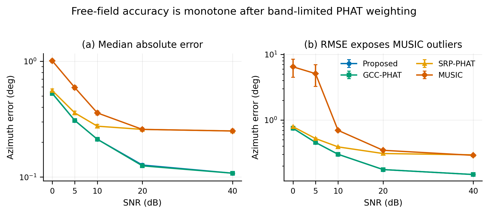
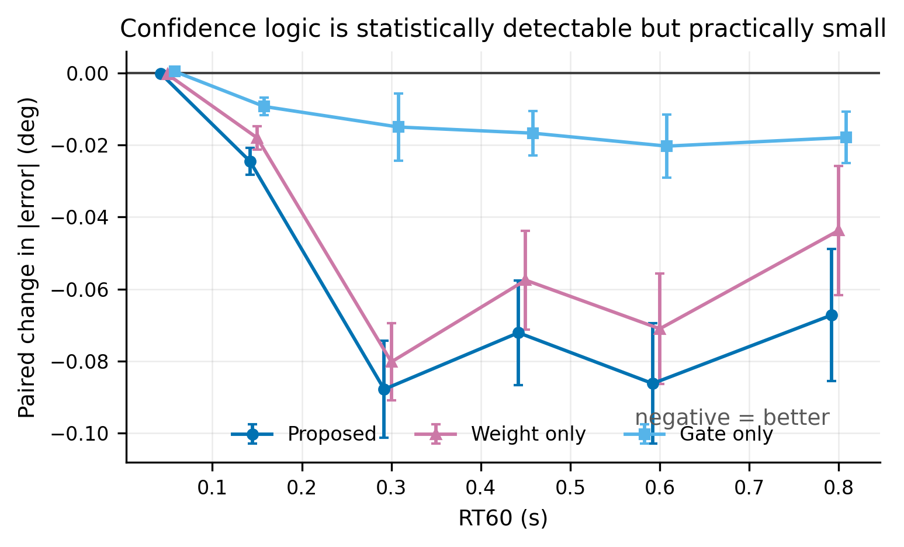
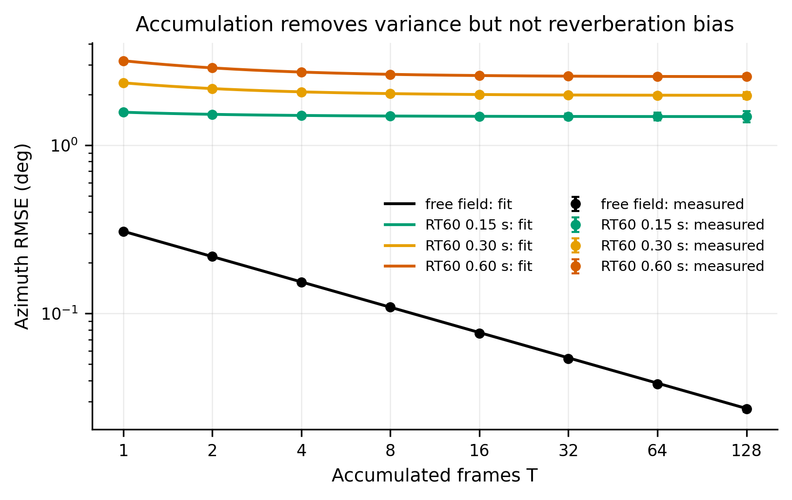
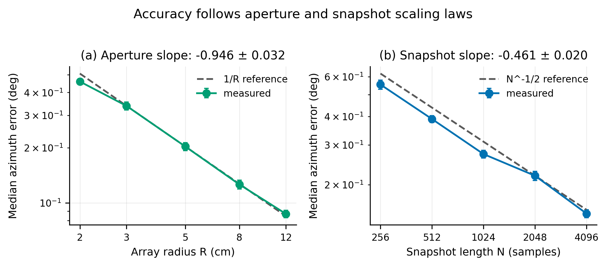

# The reverberation bias floor of a minimal three-microphone direction-of-arrival sensor

**Aneesh Arnav Chikkala**  
*Compact manuscript draft — target length: fewer than eight formatted pages*

> Hardware-dependent angular accuracy, timing, memory, and power results remain explicitly empty.
> Extended derivations, protocols, and claim audits are in `supplementary_materials_draft.md`.

---

## Abstract

Real-time sound-source localization is increasingly wanted on small, low-power, low-cost edge
devices — assistive hearing systems, wearable interfaces, robots and distributed sensors — where
direction-of-arrival (DoA) estimation must run under severe constraints on computation, memory and
energy. We ask how far a deliberately minimal system can go: three microphones on a 5 cm aperture
driven by a single microcontroller, running only generalized cross-correlation with phase transform
(GCC-PHAT) time-delay estimation and a least-squares azimuth solve. We characterize that operating
point exhaustively in simulation, with standard errors on every quantity, and we report what the
accuracy is actually limited by.

The answer is not the estimator. Once the PHAT weight is restricted to the band the source
occupies — a one-line change that we show is worth a factor of 3 to 13 depending on acquisition
bandwidth — the per-frame azimuth RMSE in free field at 10 dB SNR is 0.301 ± 0.006°, within 1.39×
of the precision attainable given the correlation interpolation grid, at 4.23 MFLOP per frame. In
any reverberant room the accuracy is instead set by a **deterministic multipath bias floor** of
1.481 ± 0.115°, 1.978 ± 0.092° and 2.557 ± 0.087° at RT60 = 0.15, 0.30 and 0.60 s. We measure that
floor two independent ways — a direct per-azimuth circular mean over 3840 frames, and a
two-parameter fit of MSE(T) = b² + σ₁²/T to accumulation curves extended to T = 128 — and they
agree to three decimal places. The floor is monotone in RT60, is reached in under 250 ms of
accumulation, and is the same for every correlation-based estimator we tested.

We report four negative results rather than suppressing them. A per-frame confidence gate and
peak-to-sidelobe weighting reduce the error by 0.02–0.09°, which is statistically significant over
540 matched frames but is 1–3 % of the error; with three microphones the pairwise system has
redundancy exactly one, which permits fault detection but never fault identification, so the
decision layer cannot pay for itself. Confidence weighting of the temporal accumulator differs from
a plain circular mean by 0.0001–0.006° and changes sign with the room, so the accumulator
simplifies to an unweighted circular mean costing five operations per frame. Temporal accumulation
itself, which reduces error as 1/√T exactly in free field (0.308° to 0.027° over 128 frames), buys
only 5.8–19.6 % in rooms because the bias floor is reached by T = 4. And incoherent wideband MUSIC,
which appears far more accurate than GCC-PHAT when the two are compared with mismatched front-end
bands, is in a fair comparison worse in free field and collapses in reverberation, with RMSE
reaching 28–36° above RT60 = 0.3 s.

We give the design envelope this implies: azimuth error scales as 1/R in aperture (log-log slope
−0.946 ± 0.032) and as N^(−1/2) in snapshot length (−0.461 ± 0.020); a sampling-rate inequality
that a 5 cm array must satisfy for the delay to be observable at all; and an implementation
recommendation — a native-length inverse FFT with parabolic peak refinement is 5.1× cheaper by the
FLOP model, uses 8× less memory, and is more accurate above 20 dB. Finally, we characterize a
physical acquisition chain against these predictions and report, from measurement, that it cannot
presently support a DoA claim: its sample rate is 999.988 Hz against a requirement in the tens of
kilohertz, so the entire azimuth range collapses into one correlation lag bin. We specify the
acquisition a valid campaign requires. The contribution is a quantified, reproducible design
envelope for minimal DoA sensors, and the identification of reverberation bias — not noise, not
compute, and not the choice of estimator — as the binding constraint.

**Keywords:** sound source localization; direction of arrival; GCC-PHAT; microphone array;
embedded systems; reverberation; benchmarking.

---

## 1. Introduction

Small edge devices need directional hearing without the channels, aperture, or compute available
to conventional arrays. Three microphones are the smallest planar configuration that can resolve a
full-circle azimuth without the two-element front–back ambiguity. They are also a difficult limit:
there are only three pairwise delays and therefore almost no redundancy for rejecting a bad pair.

This paper asks a practical question: once a three-microphone GCC-PHAT system is implemented
correctly, what sets its accuracy? We separate front-end bandwidth, delay quantisation, array
geometry, confidence logic, temporal averaging, reverberation bias, and algorithmic cost. The main
contributions are:

1. a corrected band-limited PHAT baseline with uncertainty on every reported metric;
2. a derivation showing why confidence gating cannot reliably identify a faulty pair when $M=3$;
3. two independent measurements of an RT60-dependent multipath bias floor;
4. sampling, aperture, snapshot, and compute design rules for embedded implementations; and
5. an explicit boundary between simulation-supported claims and hardware claims still requiring
   measurement.

The result is intentionally narrower than a claim of universal localization. It is a quantified
design envelope for a minimal far-field, single-source, planar azimuth estimator.

## 2. Method

### 2.1 Geometry and delay estimation

Microphone $i$ is at position $\mathbf m_i\in\mathbb R^2$. For far-field direction
$\mathbf u(\theta)=[\cos\theta,\sin\theta]^T$ and speed of sound $c$, the pair delay is

\[
\tau_{ij}(\theta)=\frac{(\mathbf m_i-\mathbf m_j)^T\mathbf u(\theta)}{c}.
\tag{1}
\]

For channel spectra $X_i[k]$ and source band $\mathcal B$, the corrected GCC-PHAT correlation is

\[
r_{ij}[\ell]=\mathcal F^{-1}\!\left\{
\mathbf 1_{k\in\mathcal B}
\frac{X_i[k]X_j^*[k]}{|X_i[k]X_j^*[k]|+\epsilon}
\right\}[\ell].
\tag{2}
\]

The indicator is essential. Full-band PHAT gives noise-only bins unit magnitude and produced the
discarded baseline. The peak lag is refined to a sub-sample delay and constrained to the physical
interval $|\tau_{ij}|\leq\|\mathbf m_i-\mathbf m_j\|/c$.

Stacking the three delay equations gives $A\mathbf u=\mathbf b$, where rows of $A$ are pair
baselines and $b_{ij}=c\hat\tau_{ij}$. The weighted least-squares direction is

\[
\tilde{\mathbf u}=(A^TWA)^{-1}A^TW\mathbf b,
\qquad
\hat\theta=\operatorname{atan2}(\tilde u_y,\tilde u_x).
\tag{3}
\]

### 2.2 Confidence, hedging, and the three-microphone limit

For pair $p$, confidence is derived from peak-to-sidelobe ratio

\[
q_p=\frac{r_p[k_p]-\mu_{p,\mathrm{side}}}
{\sigma_{p,\mathrm{side}}+\epsilon},
\qquad
w_p=\left[\max(0,q_p-q_0)\right]^\gamma.
\tag{4}
\]

These scores are **relative quality indicators, not probabilities**. A probabilistic statement
such as $P(|e|<\delta\mid q)$ requires held-out calibration; the present paper therefore reports
paired performance conditional on the score instead of calling $q$ confidence in a statistical
sense.

With $M$ microphones there are $P=M(M-1)/2$ pair equations for two direction components, so the
linear redundancy is

\[
\rho=P-2.
\tag{5}
\]

At $M=3$, $P=3$ and $\rho=1$. One inconsistent equation can be detected, but each of the three
pairs is equally compatible with the other two; the faulty pair cannot be identified without side
information. Dropping a pair also leaves a two-equation solve with worse conditioning. Equation
(5) predicts that hard gating will have little leverage, which the matched ablation tests directly.

### 2.3 Temporal accumulation and bias-aware uncertainty

The retained estimator uses the unweighted circular mean

\[
\hat\theta_T=\operatorname{atan2}\!\left(
\sum_{t=1}^{T}\sin\hat\theta_t,
\sum_{t=1}^{T}\cos\hat\theta_t
\right).
\tag{6}
\]

Write the frame error at azimuth $\theta$ as $e_t=b(\theta)+\varepsilon_t$, where the multipath
bias is fixed and $\varepsilon_t$ is zero-mean frame noise. Averaging gives

\[
\operatorname{MSE}(T)=b^2+\frac{\sigma_1^2}{T},
\qquad
\operatorname{RMSE}(T)=\sqrt{b^2+\frac{\sigma_1^2}{T}}.
\tag{7}
\]

This equation is the central hedge on the system claim: more frames reduce variance but cannot
cross the bias floor $b$. If weights $w_t$ are retained, their variance benefit is governed by the
effective sample size

\[
T_{\mathrm{eff}}=\frac{(\sum_t w_t)^2}{\sum_t w_t^2}\leq T.
\tag{8}
\]

Weighting helps only if score-conditioned variance decreases enough to offset the loss in
$T_{\mathrm{eff}}$. That condition is not met here.

### 2.4 Sampling and compute constraints

For an equilateral array with circumradius $R$, pair spacing is $\sqrt3R$ and the maximum physical
delay in samples is

\[
n_{\max}=\frac{\sqrt3Rf_s}{c}.
\tag{9}
\]

With interpolation factor $I$, angular delay-grid quantisation is approximately
$\sigma_{\theta,q}=c/(\sqrt{54}RIf_s)$. A practical rate must satisfy

\[
f_s\geq\max\!\left\{
2f_2,
\frac{c}{\sqrt{54}RI\varepsilon_q},
\frac{\kappa c}{\sqrt3R}
\right\},
\qquad \kappa\approx5\text{--}10.
\tag{10}
\]

The three terms preserve bandwidth, bound angular quantisation, and provide enough native lag
samples. For $R=5$ cm, the final term alone is 19.8–39.6 kHz. Interpolation cannot recreate
bandwidth or physical delays absent from the sampled signal.

## 3. Evaluation

The simulation reference uses three equilateral microphones, $R=5$ cm, $f_s=48$ kHz,
$N=2048$, a 300–3400 Hz source band, and independent matched trials. Free-field sweeps use 21
azimuths × 60 trials = 1260 frames per cell. Reverberation and confidence ablations use nine
azimuths × 60 trials = 540 matched frames per cell. Accumulation uses independent, non-overlapping
blocks through $T=128$. Reported uncertainties are standard errors; paired variants share the same
snapshots. Room simulation uses a 6 × 5 × 3 m image-source room, source distance 1.5 m, and image
order 12. Complete seeds, estimator pseudocode, fairness controls, and derivations are in the
supplement.

The principal comparisons are GCC-PHAT, the gated/weighted variant, SRP-PHAT, and incoherent
wideband MUSIC. All methods use the same acquisition and source band. This avoids the earlier
invalid comparison in which MUSIC received a band-limited front end while GCC-PHAT whitened the
full spectrum.

## 4. Results

### 4.1 Corrected free-field baseline

Band-limited GCC-PHAT reaches $0.301\pm0.006^\circ$ RMSE at 10 dB SNR. The gated estimator is
numerically identical within uncertainty. SRP-PHAT and MUSIC approach their 1° search-grid floor at
high SNR, while MUSIC has catastrophic low-SNR outliers that are visible in RMSE but not the median.

**Figure 1.** Free-field error versus SNR; points show tabulated estimates and bars show standard
errors. The vector version is `figures/generated/fig_free_field_snr.svg`.

### 4.2 Confidence logic has negligible practical value

Against plain GCC-PHAT, the combined gate and PSR weighting changes mean absolute error by
$-0.0245$ to $-0.0878^\circ$ for RT60 = 0.15–0.80 s. The paired differences are statistically
resolved, but amount to only 1–3% of the total error. Weighting supplies most of the change; gating
alone contributes at most $0.0203^\circ$. This agrees with the rank argument in Eq. (5): the score
can detect inconsistency, but three microphones cannot identify which pair should be discarded.

**Figure 2.** Paired change in absolute error relative to plain GCC-PHAT; negative values favor the
variant. Error bars are paired standard errors.

### 4.3 Reverberation creates a deterministic floor

Figure 3 compares accumulation curves with Eq. (7). In free field, RMSE follows $T^{-1/2}$ from
$0.308^\circ$ at one frame to $0.027^\circ$ at 128 frames. In rooms, the useful reduction is mostly
complete by $T=4$. Fitted floors are $1.480\pm0.016^\circ$, $1.977\pm0.014^\circ$, and
$2.553\pm0.014^\circ$ for RT60 = 0.15, 0.30, and 0.60 s. Direct per-azimuth circular means give
$1.481^\circ$, $1.976^\circ$, and $2.554^\circ$: agreement to three decimals without using the
accumulation fit.

**Figure 3.** Measured RMSE and $\sqrt{b^2+\sigma_1^2/T}$ fits. Reverberation fixes the asymptote;
longer averaging only removes the variance term.

Confidence-weighted and plain circular accumulation differ by only 0.0001–0.006° and the sign
changes across rooms. The final accumulator is therefore Eq. (6), not a weighted average.

### 4.4 Resource laws and implementation choice

The median error scales with radius as $R^{-0.946\pm0.032}$ and with snapshot length as
$N^{-0.461\pm0.020}$, consistent with the predicted $R^{-1}$ and $N^{-1/2}$ laws.

**Figure 4.** Measured scaling with theoretical reference slopes. Each point contains 660 frames.

The analytical GCC-PHAT cost is 4.227 MFLOP/frame; adding gating raises it to 4.522 MFLOP without
measurable free-field accuracy gain. An eightfold zero-padded inverse FFT contributes 87.2% of the
baseline cost. Replacing it with a native-length inverse FFT and parabolic peak refinement reduces
the model cost to 0.823 MFLOP/frame, a 5.13× reduction, and the reusable correlation buffer from
128 kB to 16 kB. Target-device latency and energy remain **[HARDWARE DATA REQUIRED]**.

## 5. Hardware boundary and limitations

The available acquisition chain is evidence about invalid sampling, not about localization
accuracy. Its measured 999.988 Hz rate gives $n_{\max}=0.252$ for $R=5$ cm, so all physical
azimuths occupy one integer lag. It cannot validate a DoA claim, regardless of interpolation.

The following remain empty until a valid hardware campaign is run:

| Quantity | Required value |
|---|---|
| Physical microphone coordinates and tolerances | **[HARDWARE DATA REQUIRED]** |
| Measured room RT60 and source geometry | **[HARDWARE DATA REQUIRED]** |
| Hardware azimuth RMSE, median, p90, and CDF | **[HARDWARE DATA REQUIRED]** |
| End-to-end latency and dropped-frame rate | **[HARDWARE DATA REQUIRED]** |
| Peak SRAM, sustained CPU load, and energy/frame | **[HARDWARE DATA REQUIRED]** |

The valid scope is one stationary far-field source in a horizontal plane. Elevation, near-field
range, moving sources, simultaneous sources, microphone mismatch, clock skew, and real-room
generalization are not established. The image-source model also cannot reproduce every scattering
or transducer effect. These are limitations on external validity, not reasons to weaken the
simulation result.

## 6. Conclusion

A correctly band-limited three-microphone GCC-PHAT estimator is already precise in free field and
cheap enough for embedded use. The remaining error in rooms is not primarily stochastic and is not
removed by a more elaborate decision layer. It is a deterministic, RT60-dependent multipath bias
that appears within the first few frames and survives temporal accumulation.

The defensible design is therefore simpler: band-limit the PHAT weight, use all three pairs, solve
uniform least squares, average directions with a plain circular mean, and spend hardware budget on
sampling rate and aperture rather than confidence logic. The compact claim is not that three
microphones solve general localization; it is that their achievable envelope can be predicted, and
that reverberation bias—not compute—is the binding constraint inside that envelope.

## Data, code, and references

Figure generation is reproducible with `py figures/generate_paper_figures.py`. Numerical provenance
is recorded in `rebaseline_results.md`; full mathematics and hardware protocols are in
`supplementary_materials_draft.md`. Citation records are maintained in `references.md`, including
Knapp and Carter for GCC-PHAT, Schmidt for MUSIC, Allen and Berkley for image-source simulation,
DiBiase for SRP-PHAT, and the microphone-array texts and surveys cited throughout the supplement.

**Funding:** [HARDWARE DATA REQUIRED]  
**Conflicts of interest:** none declared.  
**Acknowledgements:** [HARDWARE DATA REQUIRED]
